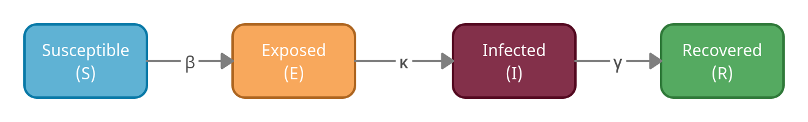

/badge.svg)
/badge.svg)

## Table of contents
* [General info](#general-info)
* [Deterministic Model](#deterministic-model)
* [Setup](#set-up)

## General Info
This program models the outbreak of an infectious disease with the SEIR model. The SEIR model is a compartmental model with four compartments: susceptible (S), exposed (but not yet infectious) (E), infectious (I), and recovered (R). Each individual is in one compartment at a time, and different rates quantify the movement of an individual from one compartment to another. 

Two submodels are defined in the program: a deterministic SEIR model and a stochastic SEIR model. Both are non-spatial and are time dependant. When the population size is small, the emergent behaviour of the two systems (deterministic and stochastic) can significantly differ. When the population size is larger, the dynamics tend to better align.

## Deterministic SEIR
The deterministic model supposes that the population is large and well-mixed, and that small fluctuations in compartments do not impact the general solution. The conceptualisation of the model is illustrated below, and the parameters are described in a table below.

| Parameter     | Description                                                                             | Unit |
| ------------- | --------------------------------------------------------------------------------------- | ---- |
| β             | Average number of contacts per person per time, divided by the total population number  | 1/t  |
| κ             | Inverse of the average latent period                                                    | 1/t  |
| γ             | Inverse of the average duration of infectiousness                                       | 1/t  |

β > 0 controls the rate of tranmission, κ > 0 the rate at which exposed individuals become infectious, and γ > 0 the rate at which individuals recover. 

The deterministic model solves this set of ODEs: 

The system of ODEs is nonlinear and must be solved by numerical integration methods. 

## Stochastic SEIR
The stochastic model also supposes that the population is homogeneous, but it supposes that small fluctuations in compartments count toward the general solution. It models the population discretely and allows stochastic movements between compartments. The model can be illustrated as a set of chemical reactions:

## Set up
